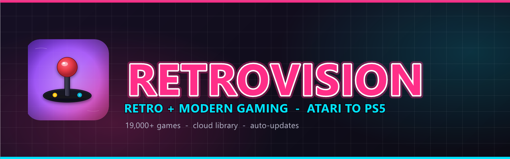

<p align="center">
  
</p>

<h1 align="center">RetroVision</h1>

<p align="center"><b>Your home for retro and modern gaming, all in one place — from Atari to PS5.</b></p>

**RetroVision** is an emulation front-end for **Windows** featuring a massive, system-organized library, a custom interface, and a **cloud-based game library**: games appear as lightweight shortcuts and are downloaded on demand from Google Drive. This repository is also the official channel for RetroVision's **automatic updates**.

---

## ✨ Highlights

- 🎮 **19,000+ games** cataloged and organized by system (3DO, Amiga, Arcade, Atari, C64, Dreamcast, GBA, MAME, N64, NES, PS1/PS2/PS3/PS4/PS5, PSP, PS Vita, SNES, Saturn, Switch, Wii/Wii U, Xbox/360/One… and much more).
- ☁️ **Cloud library (stub system):** each game shows up as a ~1 KB shortcut file pointing to the real file on Google Drive. You only download what you actually want to play — the local package stays lean.
- 🎨 **RetroVision interface:** custom theme, its own loading screen, intro videos, and system artwork.
- 🔄 **In-menu automatic updates:** one click on **"Update RetroVision"** downloads and applies the latest version published here (closes and reopens on its own).
- 🚫 **No bloatware / offline-first:** third-party online downloaders and update checkers are disabled by default.
- 🎵 Support for peripherals and system-specific configs (e.g., guitar controller on PS2, various gamepads).

---

## ☁️ How the stub system works

Instead of storing dozens of GB of games locally, RetroVision uses **stubs**: ~1 KB files with the same name as the game, containing a direct Google Drive link.

```
https://drive.google.com/file/d/XXXXXXXXXXXX/view

RETROVISION-STUB v1
name=Game Name.ext
```

This keeps the install lightweight, and each game is pulled from the cloud only when you want to play it. Artwork (box art/logo), videos, and metadata are already bundled so browsing looks great even before anything is downloaded.

---

## 🔄 Automatic updates

This repository hosts the update packages. Inside RetroVision:

**Menu → Configuration tab → `Update RetroVision`**

The app compares your installed version with the latest *Release* in this repo and, if there's something new, downloads `update.zip`, applies it over the installation, and relaunches automatically.

### 📤 For the maintainer — how to publish an update

1. Build an **`update.zip`** containing only the changed files, with paths **relative to the install root** (e.g., inside the zip: `system\...`, `emulationstation\...`, `roms\...`).
2. Create a **Release** in this repository with a **tag higher than the current one** (e.g., `v2.1`, `v2.2`…).
3. Attach the file to the Release with the exact name **`update.zip`**.
4. Done ✅ — everyone who clicks "Update RetroVision" gets the new version.

> The installed version is tracked in `system/.rv_version`.

---

## 📦 Requirements

- **Windows 10 / 11** (64-bit)
- Disk space for the base install plus whichever games you choose to download
- Internet connection to download games and updates
- A Google account with access to the games folder (for the stub system)

---

## 💜 Support / Donate

If RetroVision is useful to you, you can support the work with crypto — thank you! 🙏

<table align="center">
  <tr>
    <td align="center"><br><b>Bitcoin (BTC)</b></td>
    <td align="center"><br><b>Solana (SOL)</b></td>
    <td align="center"><br><b>Ethereum (ETH)</b></td>
  </tr>
</table>

| Coin | Address |
|---|---|
| **Bitcoin (BTC)** | `bc1qwp57z0dg0cfa5s2r5mpll7y0aaxsewpmwe26w3` |
| **Ethereum (ETH)** | `0xb3aa08be8275fdc92c61fbce1d5e96961c55cf72` |
| **Solana (SOL)** | `J8wf8j2QVR85Ruzjgdb6UxoKJeLqa4v8EjvpkTcxwvHz` |

## 🧩 Credits & foundation

RetroVision is a **customization/fork of [RetroBat](https://www.retrobat.org/)**, which itself integrates **EmulationStation** (Batocera ecosystem) and many open-source emulators. Full credit to the original projects and their respective communities and licenses.

---

## ⚖️ Legal notice

This repository **does not distribute games, BIOS files, or any copyrighted material**. Stubs are just empty shortcuts; each user is responsible for providing games they legally own. Trademarks, logos, and game/console names mentioned belong to their respective owners and are used for identification purposes only.

---

<p align="center">Made with ❤️ for the retro community • <b>RetroVision</b></p>
